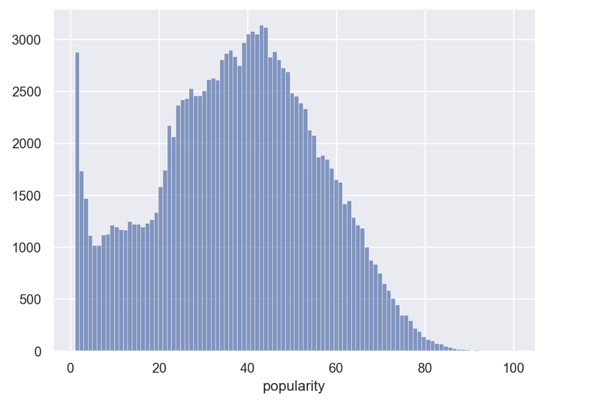
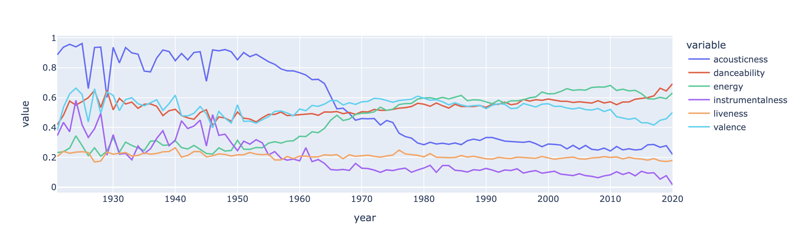
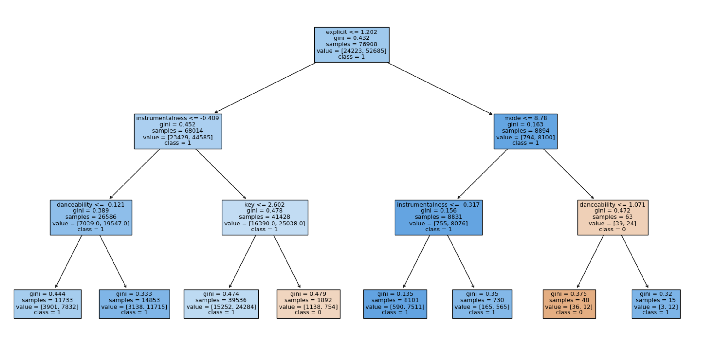
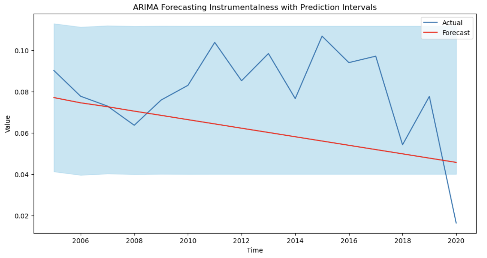

# Through the Ages: Song Popularity Classification Over Time 

by Allison Ward for Flatiron School | May 30, 2024

## Repository Contents:
- Jupyter notebook labeled "notebook.ipynb"
- Data folder labeled "data"
- Presentation pdf labeled "presentation.pdf"

## Table of Contents
- Project Overview
- Data Overview
    - Popularity as a classification metric
    - Splitting by year
- Exploratory Data Analysis
- Model Preprocessing
- Modeling: Classification
    - Dummy Classifier
    - Logistic Regression
    - Decision Tree Classifier
    - XG Boost
- Evaluation
- Modeling: Time Series Analysis
    - ARIMA - Instrumentalness
    - ARIMA - Danceability
- Conclusion and Business Recommendations
- Sources
- Interactive Tableau Dashboard 

# Project Overview
Wavelengths is a new music streaming company seeking to introduce listeners to the best possible listening experience. The task at hand was to create a classification system for new music pitched to their service to determine song popularity. Recommending songs that are popular will likely increase listening time and user satisfaction. Time series analysis was also performed to predict future trends in musical features.

 For a new streaming service, these are essential ways to keep listeners on their app and enjoying the songs they love. Increased streaming time will likely increase revenue and customer buy-in for the service, which is essential in today’s competitive market. 

# Data Overview

The dataset includes 170,653 Spotify songs, each with quantified audio features such as valence, energy, danceability, tempo, as well as track information such as duration and year released. Songs range from all genres, spanning release years between 1921 to 2020. While the data analyzes Spotify song features, Wavelengths will be able to analyze trends in the data to implement in their own service. 

There is a limitation to the dataset: “popularity” might be biased, as it is unclear how this measure was quantified. It’s assumed that it encompasses how the songs were received by the public through some qualification such as physical sales, number of streams, or number of playlist adds. 

Additionally, not all songs in the dataset had a popularity score. Songs with no ratings were not used in the analysis
 

# Exploratory Data Analysis

“Popularity” was the metric used for classification, which ranges from 0 to 100. While other features were included in the official Spotify API, there was no explanation of popularity. It is assumed that a higher popularity is representative of more popular songs, with lower popularity representative of less popular songs. There was an unusual amount of 0’s in the data (16%), which upon further inspection is likely because 0 is representative of a null value. Therefore, zeroes were removed, leaving a bell curve of popularity. 

After analyzing popularity without 0's skewing the data, the median value was found to be 38. Additionally, out of 142,761 songs, only 1 was labeled with a score of 100. To account for this, "popular" songs were defined as those with a popularity scoring of 38 or higher. 

After exploring the data, it was found that there was a significant change in audio features around the time of the late 1960's. Specifically, acousticness became significantly less prevalent, while energy became much more prevalent. Therefore, modeling was performed on data from 1968-2020.

# Model Preprocessing
Using domain knowledge and further analysis, the features kept for the model were:
- valence
- acousticness
- danceability
- duration_ms
- energy
- explicit
- instrumentalness
- key
- liveness
- mode
- speechiness
- tempo  

One Hot Encoding was used for categorical variables, and Standard Scaling was used for numeric variables. There were not missing values, and therefore imputing was not necessary.

# Modeling: Classification Based on Popularity

Three classification models were used: Logistic Regression Classifier, a Decision Tree Classifier, and an ensemble method - namely, XG Boost. 

The decision tree model demonstrates that after 1968 the main factors determining song popularity is instrumentalness, danceability, key, mode, and whether or not a song is explicit are the key factors to determining whether or not a song will be popular. 

# Model Evaluation

The evaluation metric that makes the most business sense is precision. If the model classifies a false positive (a song is listed as popular but it is not) there is a higher probability the listener will skip the song if they don't like it. If the model classifies a false negative (a song is not listed as popular but it is) it will likely not be recommended to the listener and will hence not be heard. For business purposes, it makes the most sense to maximize listening time.

### Precision Scores per model:
- Logistic Regression: 80%.
- Decision Tree: 69%.
- XG Boost: 74%.

# Modeling: Time Series Analysis

Focusing on two of the most important continuous numeric features since 1968, instrumentalness and danceability, time-series analysis was performed to predict future outcomes. Since there does not appear to be seasonality, Autoregressive Integrated Moving Average (ARIMA) was chosen as the best model. An ADF test was used to determine stationarity, and it was concluded that first-order differencing was needed for the best ARIMA results.

Results of forecasting indicate the trends of low instrumentalness and increasingly high danceability will persist into the future. 

# Business Recommendations & Insights

Recommendations:
- Most popular songs are in major keys
- G, C, D, and A are the most common keys
- Avoid explicit lyrics
- Songs with high danceability will likely persist in popularity
- People gravitate towards songs with lyrics

## Future Steps
- Analyzing audio features of specific genres

## Sources
Photo by Totte Annerbrink on Unsplash
 https://www.kaggle.com/datasets/vatsalmavani/spotify-dataset

 ## Interactive Tableau Dashboard 
 https://public.tableau.com/app/profile/alli.ward/viz/ThroughtheagesSongPopularityClassificationOverTime/Dashboard1#2 
